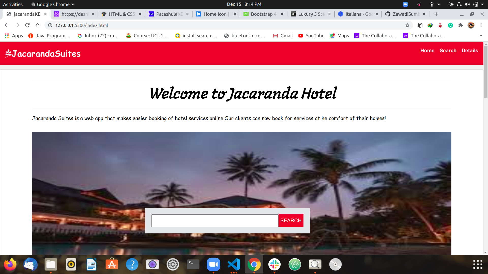

# HTML_CSS_Capstone_project

This my  final project in the HTML/CSS  module at Microverse. In it, I have showcased bootstrap.

The project is a hotel web app that entails the services offered, location of the hotel in different parts of the country and other UX designs. The app focuses on giving clients an easier time to book for various facilities the hotel offers

The website is fully responsive with the help of three `media query` `breakpoints` (the default being the smaller viewport), namely: `< 768px`, `>= 768px`, `>= 1024px`, `>= 1280px`.

## Built With

- HTML
- CSS
- Bootstrap

## Live demo link

 [Live demo](https://zawadisumba66.github.io/HTML_CSS_Capstone_project/)

## Getting Started

To get a local copy up and running follow these simple example steps.

- `git clone https://github.com/ZawadiSumba66/HTML_CSS_Capstone_project.git`
- `cd capstone-project`
- `git checkout -b capstone_branch`
- `git pull origin capstone_branch`
- If you have vscode `live-server` installed, run it and open `localhost:3000`

## Author

👤 **Rose Sumba**

- GitHub: [@ZawadiSumba66](https://github.com/ZawadiSumba66)
- Twitter: [@zawadirose1](https://twitter.com/zawadirose1)
- LinkedIn: [rose-sumba](https://www.linkedin.com/in/rose-sumba-9b36401b5/)

## 🤝 Contributing

Contributions, issues, and feature requests are welcome!

## Show your support

Give a ⭐️ if you like this project!

## Acknowledgments

- Hat tip to [Patashule](https://www.behance.net/gallery/25563385/PatashuleKE) for the insipiration towards building the website.
- Hat tip to Microverse for their `README` template.

## 📝 License

Copyright 2020 Rose Sumba

Permission is hereby granted, free of charge, to any person obtaining a copy of this software and associated documentation files (the "Software"), to deal in the Software without restriction, including without limitation the rights to use, copy, modify, merge, publish, distribute, sublicense, and/or sell copies of the Software, and to permit persons to whom the Software is furnished to do so, subject to the following conditions:

The above copyright notice and this permission notice shall be included in all copies or substantial portions of the Software.

THE SOFTWARE IS PROVIDED "AS IS", WITHOUT WARRANTY OF ANY KIND, EXPRESS OR IMPLIED, INCLUDING BUT NOT LIMITED TO THE WARRANTIES OF MERCHANTABILITY, FITNESS FOR A PARTICULAR PURPOSE AND NONINFRINGEMENT. IN NO EVENT SHALL THE AUTHORS OR COPYRIGHT HOLDERS BE LIABLE FOR ANY CLAIM, DAMAGES OR OTHER LIABILITY, WHETHER IN AN ACTION OF CONTRACT, TORT OR OTHERWISE, ARISING FROM, OUT OF OR IN CONNECTION WITH THE SOFTWARE OR THE USE OR OTHER DEALINGS IN THE SOFTWARE.
